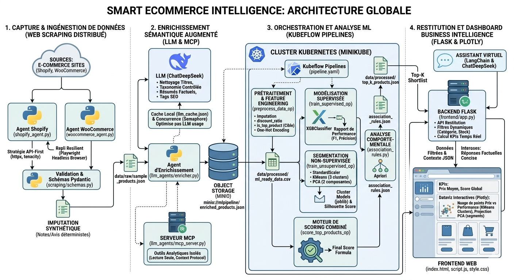
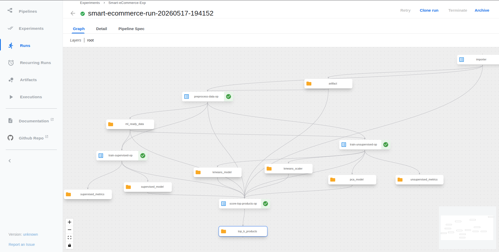
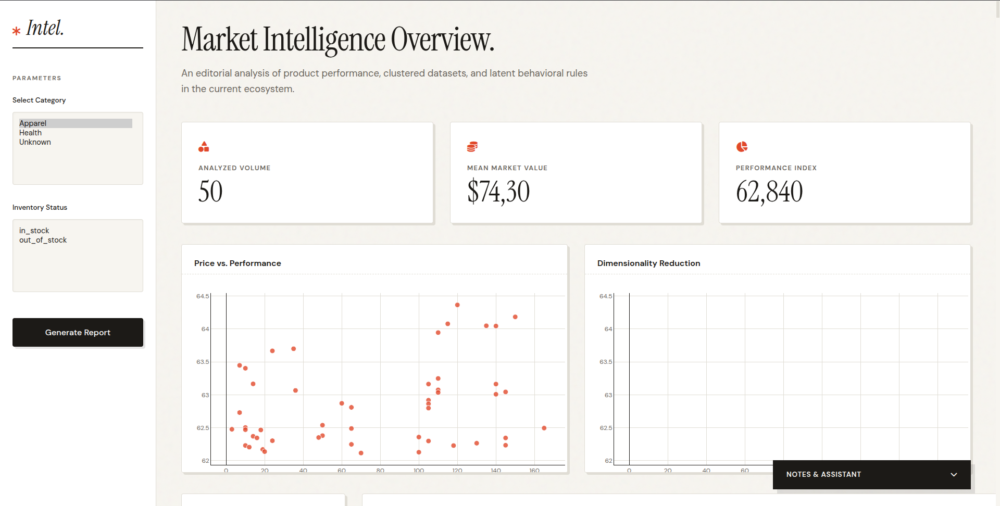

# 🛒 Smart eCommerce Intelligence

> **An End-to-End Autonomous eCommerce Intelligence & MLOps Platform**  
> *From automated web scraping to ML-driven behavioral analysis and BI visualization.*

[](https://www.python.org)
[](https://kubernetes.io)
[](https://www.kubeflow.org/)
[](https://langchain.com)
[](https://deepseek.com)
[](https://flask.palletsprojects.com/)
[](https://min.io/)

---

## 🎯 Overview & Business Value

**Smart eCommerce Intelligence** is a comprehensive, scalable platform designed to automate the extraction, semantic enrichment, and machine learning analysis of e-commerce product data. 

By leveraging autonomous Agent-to-Agent (A2A) scraping, Model Context Protocol (MCP) for secure LLM integration, and Kubernetes-native MLOps orchestration, the system delivers actionable insights ranging from dynamic product scoring to behavioral predictive modeling. 

**Key Objectives:**
- **Automated Data Ingestion:** Zero-touch extraction from diverse e-commerce platforms.
- **Semantic Data Enrichment:** Utilizing DeepSeek LLM for advanced feature engineering and attribute extraction.
- **Predictive Analytics:** Supervised (XGBoost) and Unsupervised (K-Means/PCA) pipelines to surface Top-K performing products.
- **Interactive BI:** Real-time dashboards with an integrated AI virtual assistant for data querying.

---

## 🏗️ System Architecture



The application is built on a resilient, microservices-oriented architecture divided into four core layers:

1. **A2A Scraping Layer:** Autonomous agents built to extract data from target eCommerce platforms (Shopify, WooCommerce) with intelligent fallback mechanisms using Playwright for dynamic rendering.
2. **LLM Enrichment Layer:** Leverages DeepSeek integrated via a secure MCP (Model Context Protocol) server to semantically enrich raw product descriptions into structured, ML-ready features.
3. **MLOps Orchestration Layer:** Built heavily on **Kubeflow** and **MinIO**. This layer ensures reproducible, scalable model training, tracking artifacts, metrics, and serving deployment graphs natively on Kubernetes.
4. **BI & Presentation Layer:** A Flask-based backend serving a highly interactive Plotly-driven frontend, complemented by a LangChain-powered conversational UI.

---

## ⚙️ MLOps Pipeline (DAG)



Our core machine learning workflow is orchestrated as a Directed Acyclic Graph (DAG) executed on Kubeflow Pipelines:
- **Preprocessing:** Data cleaning, normalization, and semantic mapping.
- **Parallel Training:**
  - *Supervised Learning:* XGBoost models predicting product success metrics.
  - *Unsupervised Learning:* K-Means clustering and PCA for behavioral segmentation and dimensionality reduction.
- **Scoring Engine:** A unification step that scores and ranks products, calculating the definitive Top-K recommendations and extracting association rules.

---

## 📊 Interface and BI Dashboard



The interactive analytics frontend provides deep operational visibility:
- **Real-Time KPIs:** Live monitoring of extraction rates, processing times, and accuracy scores.
- **Advanced Dataviz:** 3D PCA projections and K-Means cluster distributions utilizing Plotly.
- **AI Virtual Assistant:** A LangChain-driven chat interface allowing users to interrogate the data in natural language.

---

## 🚀 Prerequisites & Installation

### Environment Configuration
Ensure your environment variables are configured. Create a `.env` file at the root:
```bash
# Core LLM Access
DEEPSEEK_API_KEY="your_deepseek_api_key_here"

# Storage & Infrastructure (Adjust as per your cluster config)
MINIO_ACCESS_KEY="minioadmin"
MINIO_SECRET_KEY="minioadmin"
```

### Deployment via Makefile
The repository utilizes a centralized `Makefile` for streamlined cluster and pipeline lifecycle management.

```bash
# 1. Initialize the Kubernetes cluster (e.g., Minikube/Kind)
make k8s-start

# 2. Deploy Kubeflow Pipelines and MinIO dependencies
make kfp-install

# 3. Apply custom Kubernetes manifests (Networking & Storage configurations)
make apply-manifests

# 4. Trigger the ETL & MLOps Pipeline
make run-pipeline

# 5. Start the frontend BI Dashboard locally
make serve-frontend
```

---

## 📂 Project Structure

```text
.
├── docs/                 # Architectural diagrams and specifications
├── frontend/             # Flask backend, HTML/JS/CSS assets & Plotly views
├── k8s-manifests/        # Kubernetes manifests and Kustomize configs
├── llm_agents/           # DeepSeek MCP server, LangChain agents, schemas
├── ml_models/            # ML logic (KMeans, XGBoost), preprocessors & artifacts
├── pipelines/            # Kubeflow pipeline DAGs, components, submission scripts
├── scraping/             # A2A spiders (Shopify, WooCommerce), Playwright configs
├── scripts/              # Infrastructure utilities (e.g., MinIO artifact upload)
├── Dockerfile            # Container definition for various microservices
├── Makefile              # Centralized DevOps & MLOps operational commands
└── requirements.txt      # Core Python dependencies
```

---

## 👥 Authors and Contributors

Conceptualized, architected, and engineered by:

- **Yassine Kamouss** - *Cloud Architecture & MLOps Engineering*
- **Mohammed Salhi** - *AI Integration & Data Engineering*

---
